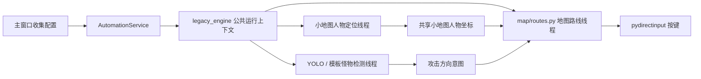

# QQ炫舞 3.0：项目梳理与优化建议

## 1. 项目定位

这是一个仅面向 Windows 的桌面自动化工具，主要能力包括：

- 使用 PyQt5 提供地图、攻击按键、药水阈值、自定义路线和日志界面。
- 使用 MSS 截取游戏窗口的固定区域。
- 使用 Ultralytics YOLO 或 OpenCV 图片模板识别怪物。
- 使用人物模板识别战斗区域中的角色位置，并使用小地图黄色点判断路线位置。
- 使用 `pydirectinput` 执行移动、攻击、补血、补蓝和符文方向按键。
- 使用后台线程分别执行地图路线、怪物检测和小地图人物定位。
- 支持普通自动化模式和不发送按键的安全检测测试模式。

项目当前注册 18 个地图选项，模型目录约 343 MB，是项目体积的主要来源。

## 2. 当前目录职责

```text
正式版3.0.py
  程序入口、测试模式参数和打包自检入口

v3/
  app.py
    Qt 应用装配、异常处理、热键和日志桥接

  main_window.py
    界面控件、配置收集、状态展示和测试预览

  config.py
    AppConfig 配置模型、校验、兼容读取和原子保存

  automation_service.py
    自动化主线程、检测子线程、停止和按键释放

  detection_test_service.py
    只截图、识别和绘制的安全测试模式

  public/
    monster_detection.py
      正式/测试模式共用的模板匹配、血条识别、检测阈值和自定义模板目录

    combat_strategy.py
      怪物快照、攻击优先级、目标方向锁、追怪抗抖和AI动作意图

    combat_actions.py
      所有地图统一调用的攻击、转向、追怪和路线恢复入口

    route_recording.py
      分段路线录制、坐标去重、平台绳子连接、JSON和预览图生成

    minimap_tracking.py
      小地图黄色人物点识别、持续坐标发布和人物轨迹日志

    movement_actions.py
      跨地图复用的移动、跳跃和爬绳动作

  person_locator.py
    人物模板选择、匹配和攻击参考高度

  map/
    definitions.py
      地图显示名、路线入口、检测器类型和资源名

    routes.py
      18 个地图入口对应的具体走图逻辑

    mushroom_v2.py
      蘑菇V2独立的丝滑战斗与巡逻协调逻辑

  map_registry.py
    为界面和调度服务提供地图查询接口

  legacy_engine.py
    截图、模型缓存、怪物检测、攻击控制、窗口控制、符文处理和公共运行状态

tests/
  test_核心功能.py
    原有配置、注册表、资源和检测逻辑测试

  test_优化逻辑.py
    本轮新增的结构、注释、阈值、复检窗口和死代码回归测试

  test_依赖导入.py
    第三方包和全部 v3 模块的真实导入测试

  可视化检测工具.py
    独立的人工检测调试工具
```

## 3. 主要运行链路



运行时并不是“检测线程直接按攻击键”，而是：

1. 检测线程识别人物和怪物。
2. 检测线程根据距离计算左、右或群攻方向。
3. 检测线程发布攻击意图，并把路线状态设为暂停。
4. 地图路线线程消费攻击意图，调整朝向并发送攻击按键。
5. 怪物消失后，检测线程解除暂停，地图路线继续移动。

这条链路中的推理时间、日志输出、固定等待和攻击意图同步都会影响体感流畅度。

## 4. 本轮已经完成的优化

### 4.1 过滤怪物死亡动画造成的额外攻击

原生产 YOLO 调用没有显式 `conf` 参数，会使用 Ultralytics 默认的较低置信度阈值。怪物死亡动画仍然保留部分外形时，模型容易继续把它识别成怪物。

现在采用两层保护：

- 页面提供 `0.30～0.95` 的 YOLO 怪物置信度设置，正式模式和测试模式共用；默认值为 `0.65`。
- 每次真正执行攻击后开启 `POST_ATTACK_RECHECK_SECONDS = 0.45` 秒复检窗口。

复检窗口内仍然持续截图和识别，只是不再发布新的攻击按键。攻击意图增加了版本、生成时间、`0.30` 秒有效期和条件变量唤醒；攻击完成时会原子清除按键执行期间排队的旧意图。路线移动另外锁定 `0.75` 秒，且必须连续多帧并超过战斗记忆宽限后才会恢复，避免“打一下、走一步、再打”。

如果个别旧模型出现漏怪，可先把 `YOLO_MONSTER_CONFIDENCE` 从 `0.65` 微调到 `0.60`。如果死亡动画仍经常命中，优先补充死亡动画负样本并重新训练模型，不建议单纯把阈值无限调高。

### 4.2 减少检测线程和界面日志卡顿

原 YOLO 循环每帧会打印人物位置、怪物数量和左右方向；地图路线也会约每 50ms 打印一次小地图人物坐标。标准输出会跨线程转发到 Qt 文本框，高频信号和文本插入会抢占 CPU，并让识别体感变得更顿。

现在：

- YOLO 检测摘要最多每秒输出一次。
- 地图人物坐标最多每秒输出一次。
- 删除了检测分支中用于调试的逐帧人物坐标和方向日志。

### 4.3 合并重复人物匹配逻辑

原 YOLO 检测针对 `xueliang.png` 和 `dengpao.png` 分别维护一套几乎相同的模板匹配和怪物距离循环。

现在统一为一套人物匹配逻辑，仅通过 `character_attack_reference_y()` 计算两种模板不同的攻击参考高度。这样每帧只有一个清晰的目标遍历入口，后续修改阈值或坐标算法时不会出现两套分支不一致。

### 4.4 减少模板匹配重复候选

`cv2.matchTemplate` 的相邻像素经常同时超过阈值。旧代码会把所有像素坐标交给 Python，再使用两层距离比较去重。

现在先通过 3×3 邻域局部峰值筛选，再进入中心点去重。这样可以明显减少重复候选数量，尤其适合模板较大或同屏怪物较多的场景。

### 4.5 删除不可达的旧循环

兼容引擎中曾保留 14 段 `zant == 111/1111/11111` 分支及其内部 `while True`。当前项目只会给 `zant` 赋值 `0/1/2`，这些状态没有任何赋值来源，因此分支永远不可达。

这些死代码已经删除，兼容引擎减少约 590 行。地图的有效路线循环、战斗暂停和停止检查保持不变。

### 4.6 拆分地图定义和路线

地图相关代码现在集中在 `v3/map/`：

- `definitions.py` 保存地图名称、动作入口、检测方式和资源映射。
- `routes.py` 保存每张地图具体怎么走。
- `legacy_engine.py` 不再直接包含数千行地图路线，只保留公共引擎能力。

为兼容现有调度方式，兼容引擎导入完成时会把路线函数重新绑定到引擎运行上下文，因此 `AutomationService` 仍然可以按原方式调用 `legacy_engine.<地图入口>()`。

### 4.7 补充函数说明

`v3` 生产包内的所有函数和方法都已补充简洁 docstring，内容主要说明：

- 方法职责和返回值。
- 是否会启动或停止线程。
- 是否会发送按键或修改共享状态。
- 坐标属于局部截图坐标还是屏幕坐标。

### 4.8 人物灰度局部跟踪与全图重定位

人物定位在一次启动期间固定使用选中的 `dengpao.png` 或 `xueliang.png`，模板灰度图只生成一次。每帧画面也只转换一次灰度：

- 首帧在完整的 `1280×330` 人物区域定位。
- 后续优先在上一帧中心附近的 `480×240` 区域搜索。
- 第一次局部失败只标记为 `local-miss 1/2`，不立即扫描全图，也不发布攻击意图。
- 连续第二次局部失败后才执行一次全区域重定位。
- 日志和测试预览显示 `local/full/local-miss/full-miss` 以及真实匹配耗时。

人物正常走动时绝大多数帧只需匹配较小区域；人物闪现、跳层或画面切换后，最多等待一次失败帧即可重新定位。

### 4.9 YOLO、检测帧周期和按键响应

- YOLO 在推理参数中直接限定 `classes=[0]`，并把单帧最大候选数限制为 `30`，减少无关类别和后处理开销。
- 正式日志和测试预览新增怪物检测/YOLO 推理毫秒耗时。
- 检测循环改为目标帧周期：只有本帧处理得比目标周期快时才补足剩余时间；推理已经超过周期时不会再额外固定 `sleep`。
- `pydirectinput` 的全局调用间隔设为 `0.01` 秒，攻击朝向稳定等待缩短为 `0.04` 秒，群攻按键保持 `0.05` 秒。
- “木面2”原有的独立攻击轮询循环已删除，所有地图统一使用带锁、过期和死亡动画冷却的公共攻击处理。
- 为什么需要缓存、锁、复检窗口或原子保存。

### 4.8 移除源码中的固定 API 密钥

在线符文识别不再在源码中保存固定密钥，改为读取环境变量 `GLM_API_KEY`。未配置时会给出明确错误，而不是携带暴露的密钥继续请求。

PowerShell 临时设置示例：

```powershell
$env:GLM_API_KEY = "你的密钥"
python .\正式版3.0.py
```

如果原密钥曾经提交、分享或打包，应立即在服务端撤销并重新生成。

### 4.9 人物模板缺失时终止启动

自动化和安全测试模式会在启动线程和按键动作之前检查人物定位模板。只要
`dengpao.png`、`xueliang.png`（兼容 `血量.png` 和现有旧资源
`renwuxueliang.png`）中至少一张可用，就按原灯泡优先、血量备用逻辑继续；灯泡和
所有血量模板都不存在或都读取失败时，当前任务立即报错退出，不会进入没有人物坐标
的检测和走图循环。

## 5. 后续优化建议

### P0：优先处理

#### 5.1 补齐地图资源完整性校验

当前快照存在资源与文档/测试不完全一致的情况：

- `蘑菇半层上层` 没有同名模型，本轮已通过 `resource_name="蘑菇半层"` 显式复用已有模型。
- `蘑菇半图上层备用` 的模板目录在当前快照中缺失，选择该地图时无法获得有效怪物模板。
- README 和原测试还引用了当前目录不存在的 3.1、1.9、打包 spec 和工具文件。

建议程序启动时逐项检查当前选中地图所需的模型或模板，并在界面启动前给出缺失文件清单，而不是等检测线程启动后才报错。

#### 5.2 用负样本解决死亡动画误识别

阈值和复检窗口可以降低额外攻击，但模型层面的长期方案是：

- 收集每张地图的怪物死亡动画截图。
- 把死亡动画作为背景负样本，而不是怪物框。
- 补充怪物受击闪白、残影、掉落物和技能特效负样本。
- 按地图分别统计精确率、召回率和死亡残影误报率。

#### 5.3 修复完整测试基线

原 `test_核心功能.py` 中有一部分测试依赖当前快照缺失的文件，另外当前验证环境未安装 OpenCV，因此完整测试不能全部运行。建议：

- 把 1.9 基线、3.1 包、PyInstaller spec 和打包工具恢复到仓库，或删除已经失效的断言。
- 将纯静态测试和需要 OpenCV/Windows 的集成测试分组。
- 为屏幕捕获、YOLO 和按键发送提供假实现，保证 CI 不操作真实游戏窗口。

#### 5.4 统一敏感配置管理

除 `GLM_API_KEY` 外，旧引擎仍包含固定的远端 HTTP 地址。建议把网络地址、超时和是否启用在线识别统一放到配置或环境变量，并默认关闭非必要网络调用。

### P1：性能与稳定性

#### 5.5 增加 YOLO 设备和耗时诊断

目前模型推理没有显式记录运行设备。建议启动时输出：

- CPU 或 CUDA 设备。
- 模型加载耗时和首次预热耗时。
- 截图、人物匹配、YOLO 推理和整帧耗时。
- 最近 30 帧平均 FPS 和 P95 推理时间。

有可用 NVIDIA GPU 时，可评估 `device=0`、半精度和模型预热；只有在实际测量更快时再启用。

#### 5.6 把阈值和复检时间放到配置界面

不同地图模型质量不同，固定全局阈值并不一定最优。建议后续支持：

- 全局默认 YOLO 置信度。
- 地图级置信度覆盖。
- 攻击后复检时间。
- 模板匹配阈值。
- 人物匹配阈值。

同时给出推荐范围，防止误填导致完全不攻击或连续误攻击。

#### 5.7 改进线程生命周期

检测和定位子线程当前为 daemon 线程，停止时只等待固定时间。若某个第三方调用卡住，主服务可能已经显示停止，但旧子线程仍然存活。

建议：

- 为所有阻塞调用设置明确超时。
- 记录未按时退出的线程名称。
- 新任务启动前确认上一任务的子线程全部退出。
- 将共享全局状态逐步收敛到独立的运行会话对象。

#### 5.8 减少固定 `time.sleep`

地图路线仍然包含大量固定时序，这是兼容旧路线的主要技术债。建议逐张地图替换为：

- 可中断等待。
- 基于小地图坐标的状态转换。
- 明确的超时和失败恢复。
- 统一的移动、跳跃、爬绳和闪现动作函数。

不要一次性重写全部地图；应逐图录制行为、修改、回放验证。

### P2：可维护性和交付

#### 5.9 拆分 `routes.py`

本轮已经把路线移出兼容引擎，但 `routes.py` 仍然较大。后续可以按区域或每张地图继续拆分，例如：

```text
v3/map/
  definitions.py
  mushroom.py
  forest.py
  snowfield.py
  wuling.py
  time_road.py
```

每个文件只保留相关地图路线，并在 `v3/map/__init__.py` 统一导出。

#### 5.10 锁定依赖版本

`requirements-3.0.txt` 仍有多数包没有版本号。PyQt5、OpenCV、Ultralytics、PyTorch 和 NumPy 的升级都可能改变运行结果或打包体积。建议至少锁定经过验证的主次版本，并记录 Python 位数和 CUDA 组合。

本轮已先锁定会直接影响 Ultralytics DLL 兼容性的 PyTorch `2.5.1` 和
torchvision `0.20.1`；其余依赖仍建议在完成实际游戏回归后继续锁定。

#### 5.11 清理仓库入口和历史文件

根目录原有的PyCharm示例`main.py`已经删除，项目只保留明确的3.0启动入口。README中引用的启动和打包命令应继续与实际文件保持一致。

## 6. 测试与验证

本轮新增的静态回归测试：

```powershell
python -m unittest discover -s tests -p "test_优化逻辑.py" -v
```

依赖和模块导入测试：

```powershell
.\.venv\Scripts\python.exe -m unittest discover -s tests -p "test_依赖导入.py" -v
```

完整中文测试集：

```powershell
python -m unittest discover -s tests -p "test_*.py" -v
```

语法检查：

```powershell
python -m py_compile .\正式版3.0.py .\v3\*.py .\v3\map\*.py
```

手动观察识别效果：

```powershell
python .\正式版3.0.py --test
```

或运行独立工具：

```powershell
python .\tests\可视化检测工具.py
```

重点人工验证以下场景：

1. 单只怪物死亡后不再额外攻击。
2. 怪物没有死亡时，约 0.45 秒复检后能够继续攻击，期间人物不会插入巡逻移动。
3. 两只以上怪物时仍能触发群攻。
4. 怪物从左侧移动到右侧时，攻击方向可以正确切换。
5. 停止任务后所有移动和攻击键都被释放。
6. 各地图入口仍能调用 `v3/map/routes.py` 中对应路线。
7. 测试模式只截图识别，不发送任何按键。

## 7. 推荐的下一步

建议先实际运行测试模式，观察死亡动画阶段的 YOLO 置信度。如果死亡残影普遍低于 0.65，本轮阈值即可解决主要问题；如果仍高于 0.65，应优先补充负样本。确认识别稳定后，再逐张地图把固定等待改成基于坐标和状态的可中断动作。

## 8. 蘑菇地图爬绳问题分析（2026-08-06）

最新轨迹 `运行轨迹_20260806_000548_909.log` 只记录到启动后约 2.08 秒：

- 第一帧 YOLO 模型初始化约耗时 1.40 秒。
- 路线启动后先等待 2 秒。
- 日志最后一条是开始向左移动，没有边界和爬绳事件。

因此这份日志中人物尚未到达绳子位置。对比两份较长的日志，旧逻辑曾在 `(28～31, 185)` 正常触发并完成爬绳。

本轮修正了一个会在战斗后漏触发的边缘问题：

- 爬绳不再强制要求“路线编号为 2”，因为该编号可能被战斗后的怪物方向改写。
- 爬绳区域放宽为 `x=25～50, y=168～202`，仍保留 5 秒重试间隔。
- 修复爬绳对齐过程中左方向键可能未释放的问题。
- 新增 `minimap_position` 轨迹，每秒保存人物坐标、战斗状态和移动方向。

下次实测应至少运行 30～60 秒，并等人物真正经过绳子后再停止。届时可直接根据 `minimap_position` 和 `mushroom_climb_*` 事件区分“没走到绳子”、“到了但没触发”和“触发后按键失败”。

## 9. 蘑菇 V2 丝滑流程

界面新增“蘑菇V2”，保留原“蘑菇”作为兼容和对比版本。V2 复用当前 `蘑菇.pt`、人物模板、攻击距离和 YOLO 置信度配置，路线实现独立保存在 `v3/map/mushroom_v2.py`。

V2 主要差异：

- 不再固定等待 2 秒，而是等 YOLO 完成第一帧且小地图已识别到人物后再移动。
- 巡逻、战斗、爬绳互斥执行，战斗期间不会插入左右移动。
- 怪物方向只用于攻击转身，不再改写整张图的巡逻方向。
- 相同方向连续攻击时不重复轻点方向键，只有怪物从左变右或从右变左时才重新转身。
- V2 攻击后复检已临时设为 0，用于通过真实日志测量 YOLO 帧率和无复检时的攻击上限；此模式会增加死亡动画触发额外攻击的风险。
- 爬绳与“蘑菇地图1”调用同一个共享动作，沿用已经实测可用的 C+上、左移微调和持续向上时序。
- 轨迹新增 `mushroom_v2_*`、`monster_detector_ready` 事件，可分析单次战斗的攻击次数和爬绳是否真正挂上。
- 每个 `detection_frame` 新增 `frame_interval_ms`、`instant_fps`、`frame_sequence`，并每秒记录一条 `yolo_frequency_summary`，包含平均识别间隔、FPS、YOLO 推理耗时和完整帧耗时。

### V2 全量诊断轨迹

为了还原“脚本发了什么按键”与“人物在小地图上实际如何移动”之间的关系，运行轨迹现在同时记录：

- `minimap_tracking_frame`：约每 50ms 一条，记录黄色点是否命中、原始坐标、对外发布坐标、坐标停更时间和检测耗时。
- `character_trajectory`：约每 200ms 一条，记录坐标、位移差、横纵速度、是否原地、路线阶段、巡逻方向和绳子区域。
- `mushroom_v2_phase_changed`：记录 `startup/patrol/combat/combat_wait/move_lock/climb/position_missing` 之间的阶段转换。
- `movement_started/movement_stopped`：记录实际方向键、坐标、停止原因、攻击意图和移动锁快照。
- `mushroom_shared_climb_attempt`：记录 V1/V2 每次挂绳前后坐标，可判断 C+上和左移微调是否真正完成对齐。
- `potion_action`：记录补红补蓝按键，用于判断药水时序是否占用检测线程。
- `worker_started/worker_stopped/worker_error`：记录子线程生命周期和完整异常堆栈。

`character_trajectory` 还同时携带 `nearby_targets`、`last_target_direction`、`attack_pending`、`attack_recheck_remaining_ms`、`move_lock_remaining_ms`、`minimap_stale_ms` 和 `detector_ready`，因此可以直接区分人物原地不动是由战斗、移动锁、爬绳、坐标停更还是方向键未发出造成。

V2 首份全量轨迹显示人物在 `x=50` 进入爬绳流程，但旧 V2 使用了另一套挂绳成功判断，普通跳起后又落回底层，最终没有真正挂住。现在 V1 和 V2 都在 `x=25～50, y=168～202` 的原版触发范围内调用同一个共享爬绳动作；V2 不再额外要求向右巡逻，也不再维护独立的持续上移判断。这样人物第一次向左经过绳位时即可按原版方式逐步左移对齐，战斗优化仍保持独立。
